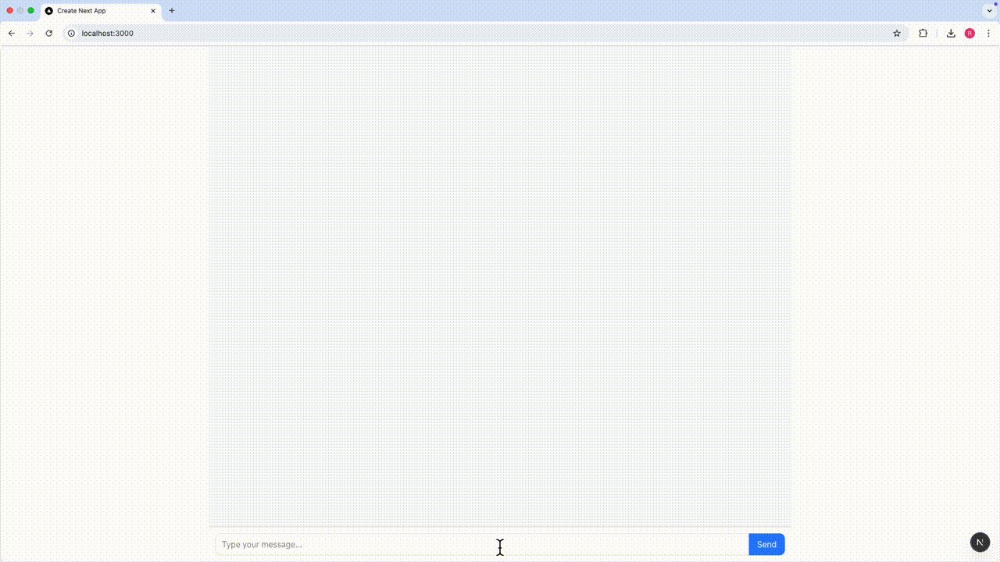

# YouTube Comments Sentiment Analyzer

A web application that analyzes the sentiment of YouTube comments using machine learning.

## Overview

This application uses a PyTorch neural network model to classify YouTube comments into different sentiment categories. 

## Project Demonstration

Below is a demonstration of the YouTube Comments Sentiment Analyzer in action:



The application provides real-time sentiment analysis of comments from YouTube videos, helping content creators understand audience reactions and engagement.


## Installationå

### Prerequisites

- Python 3.7+
- Conda (Miniconda or Anaconda)

### Step 1: Clone the repository

```bash
git clone https://github.com/romanmicuda/youtube-comments-web
cd youtube-comments-web
```

### Step 2: Set up a Conda environment

```bash
# Create a new conda environment
conda create -n youtube-comments python=3.8
# Activate the environment
conda activate youtube-comments
```

### Step 3: Install dependencies

```bash
# Install PyTorch
conda install pytorch torchvision -c pytorch
# Install other dependencies
conda install scikit-learn flask
pip install joblib flask-cors
```

### Step 4: Download pre-trained models (if available)

Place your pre-trained models and vectorizers in the appropriate directory.

## Usage

### Starting the server

```bash
python server/app.py
```

### Running the frontend

```bash
# Install dependencies
cd app
yarn install

# Start development server
yarn dev
```

The Flask server will run on http://127.0.0.1:5000 by default.
The Next.js frontend will typically run on http://localhost:3000.

## Development

### Training a new model

To train a new sentiment analysis model, refer to the training scripts in the repository.

For more details, check the [training documentation](https://github.com/romanmicuda/youtube-comments/blob/main/README.md#training).

## License

[Apache License](LICENSE)
